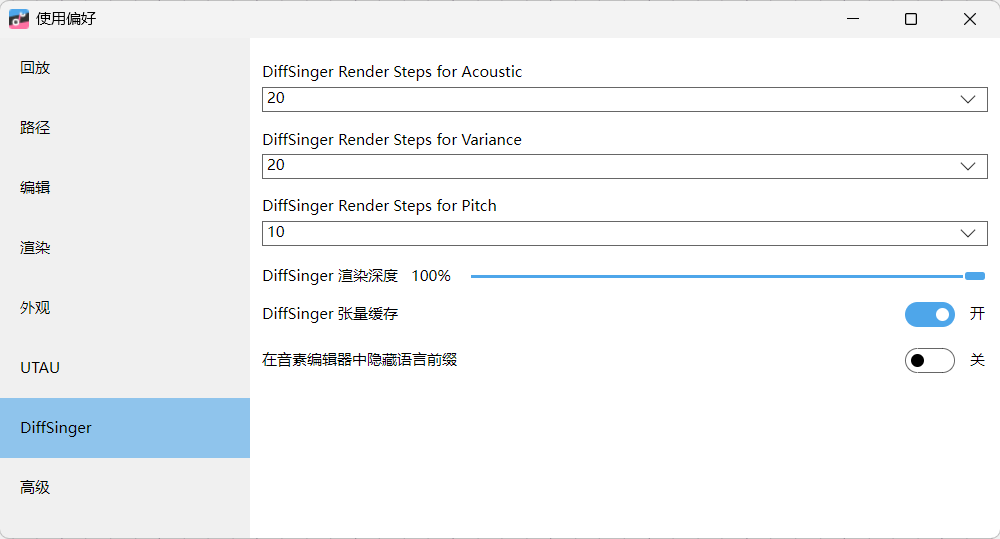

# OpenUtau v0.1.565.0 声音优化
## 简单的优化
顶部菜单：**工具 (Tools) → 使用偏好 (Preferences)**

1. 找到 渲染：
   - 有 N 卡 / AMD 独显选 **DirectML**（GPU 加速，减少失真）
   - 无独显保持 CPU
2. 找到 DiffSinger：
DiffSinger Render Speedup（渲染加速倍数）
默认 50，**改成 10~20**，数值越低音质越平滑、音符衔接自然，只是渲染速度变慢；

## 一、【渲染页面】硬件加速优化（第一张图）

### 当前问题

机器学习运行器是 CPU 渲染，速度慢、音质断层明显，你的显卡是 AMD Radeon 780M，支持 DirectML GPU 加速。

### 修改步骤

1. 机器学习运行器下拉框，从「CPU」改为 **DirectML**
2. GPU 下拉保持 `[0] AMD Radeon 780M Graphics`
3. 最大渲染线程数：4（CPU 多核充分利用，不要 2）
4. 预渲染：**关闭**，实时预览会压缩音质，仅最终完整导出时渲染
5. 退出时清空缓存：打开，避免旧缓存干扰音色
6. 修改完成后**重启 OpenUtau**生效

## 二、【DiffSinger 页面】降噪顺滑核心参数（第二张图，解决机械生硬）

### 参数作用说明
慎改，这个容易导致播放不了！！！
调整策略：播放不了就调小，DirectML 模式 数值能稍微大一点。
1. **DiffSinger Render Steps for Acoustic（声学步数）**
当前 20 → 调大。步数越高，人声过渡越柔和，消除字间割裂感，是改善塑料声最关键参数。
2. **DiffSinger Render Steps for Variance（方差噪声步数）**
当前 20 → 调大，增加人声自然颗粒感，避免完全光滑的机器人音色。
3. **DiffSinger Render Steps for Pitch（音高步数）**
当前 10 → 调大，音高变化更顺滑，消除音符垂直跳变刺耳感。
实测没啥效果
4. DiffSinger 渲染深度：保持 100%（不要降低，降低会丢失细节）
5. DiffSinger 张量缓存：保持开启，加速 GPU 渲染

建议：DirectML，20，20，20

# UTAU 设置页解读（对你当前 DiffSinger 工程无影响）

## 1. 传统音源的默认渲染器：WORLDLINE-R

- 作用：仅针对**CVVC/VCCV 传统采样声库**生效，和你正在使用的云野\_CE DiffSinger AI 声库完全隔离。
- 现状：当前选择 WORLDLINE-R 是最优传统音源配置，无需修改；切换 Classic 仅用于老旧第三方重采样器，对你无用。
- 关键区分：Diff 声库不经过此渲染管线，改这里无法改善人声生硬问题。

## 2. 默认原音设定编辑器：OpenUtau

内置编辑器，无需更换，保持默认即可。

## 3. vLabeler /setParam 路径

这两项是传统 UTAU 音源切音、参数批处理工具路径：

- 你只使用 DiffSinger，不需要配置这两个工具路径，保持空白无任何负面影响。

---

## 补充重点提醒

1. 本页面所有参数**仅管控老式拼接音源**，无法调节 DiffSinger 的顺滑度、步数、气息；
2. 优化云野\_CE 人声依旧要依靠「渲染」「DiffSinger」两个标签页参数，以及工程内 BREC/TENC/PIT 曲线；
3. 此页面无需改动任何选项，现有配置完全正常。