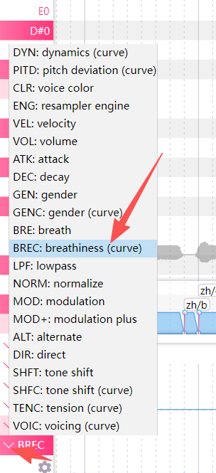

## 一、图内音素器选项区分（你的云野_CE DiffSinger必须选对）
1. **[DIFFS ZH] DiffSinger Chinese Phonemizer**
    标准DiffSinger中文音素器，**新版完整Diff声库通用**。
2. **[DIFFS RHY] DiffSinger Rhythmizer Phonemizer**
    带Rhythmizer节奏校正，**专门给老款轻量化CE声库（云野_CE）用**，能修正咬字节奏、防止渲染GRU报错、吞字拖音。
    ✅ 你用云野_CE，ZH中文音素器优先选这个。
3. ZH CVV/CVVC/VOGEN ZH：传统UTAU拼接音源，**DiffSinger完全不能用**，选错直接渲染崩溃。

## 二、最大渲染线程数设置（搭配你AMD 780M核显+CPU渲染方案）
### 1. 如果你按之前方案切换为【CPU机器学习运行器】
最大渲染线程推荐：**4**
- 设2：渲染极慢，多核性能浪费
- 设6/8：线程过多内存争抢，极易触发GRU节点崩溃报错
- 4线程平衡速度与内存占用，稳定不爆内存

### 2. 强行使用DirectML GPU渲染（不推荐，780M显存不足）
最大渲染线程必须降到 **2**
GPU显存容量小，多线程并行会瞬间占满显存，直接报GRU运行失败。

## 三、配套稳定设置汇总（解决你之前渲染崩溃）
1. 渲染页：机器学习运行器 = CPU，最大渲染线程 = 4，预渲染关闭
2. DiffSinger页：声学步数20、方差15、音高10，降低计算负载
3. 音素器：ZH中文 → 选择【DIFFS RHY】Rhythmizer版本
4. 分段渲染，不要一次性渲染超过8小节长段落
5. 定期删除UCache缓存文件夹，避免模型缓存损坏触发GRU报错

### 参数对照表（云野 CE 可用 / 不可用区分）

表格

| 参数 | 作用 | 云野\_CE 轻量化音源 |
| --- | --- | --- |
| PITD | 手绘音高曲线，自定义滑音、转音、颤音 | ✅ 完全支持（改善音符生硬断层核心） |
| DYN | 音量动态起伏，避免声音平白机器人感 | ✅ 支持 |
| BREC | 气息多少，数值越高气声越足，弱化干声机械感 | ✅ 支持 |
| TENC | 发声张力，高音降低数值防止尖锐刺耳 | ✅ 支持 |
| GENC | 性别偏移，负数偏女声、正数偏男声 | ✅ 基础支持 |
| VELC | 辅音字头速度，解决吞字、咬字过重 | ⚠️ 部分 CE 阉割，可能无效 |
| ENE | 整体发声能量强弱 | ⚠️ 大概率阉割 |
| CLR | 清晰度，高 = 咬字锐利，低 = 朦胧氛围感 | ❌ CE 轻量化大多不支持 |
| VOIC | 纯气声比例调节 | ❌ CE 轻量化大多不支持 |

### 2. 关键提示

1. 参数生效权限由音源作者决定，轻量化训练会砍掉多余参数减小模型体积，CE 系列普遍阉割 CLR/VOIC；
2. 钢琴窗底部看不到对应曲线：顶部菜单栏 **工程 → 表情 → 获取渲染器建议的表情**，一键加载当前音源全部可用曲线。
3. 调整音素长度：直接拖动音符左右两端拉伸缩短即可。

# 窗口解读：OpenUtau「表情」参数面板（适配 DiffSinger 云野\_CE）

## 一、当前选中项解析

选中：`breathiness (curve)`

- 名称：breathiness（气息量曲线）
- 简称：`brec`（官方文档里的 BREC 参数）
- 类型：曲线（可在钢琴轨道底部手绘动态变化）
- 数值范围：-100 ~ 100，默认 0
- 作用：控制人声气声多少，拉高数值会增加呼吸感、弱化机械干声，完美解决你人声生硬的问题。

## 二、左侧列表 DiffSinger 可用参数分类

### 1. 必用曲线参数（云野\_CE 全部支持）

表格

| 参数原名 | 简称 | 中文功能 |
| --- | --- | --- |
| pitch deviation (curve) | PITD | 手绘滑音、转音曲线，消除音符断层 |
| dynamics (curve) | DYN | 音量动态起伏，避免声音平直 |
| breathiness (curve) | BREC | 气息 / 气声强度 |
| tension (curve) | TENC | 发声张力，高音拉低防刺耳 |
| gender (curve) | GENC | 性别偏移，负数偏柔女声 |
| velocity (curve) | VELC | 字头辅音速度，改善吞字 |
| energy (curve) | ENE | 整体发声力度强弱 |
| voicing (curve) | VOIC | 纯气声比例（轻量化 CE 大概率无效） |

### 2. 传统音源专属固定参数（DiffSinger 完全无效）

`voice color、resampler engine、lowpass、modulation、tone shift` 等，仅 WORLDINE-R 传统渲染器生效，**不要在 Diff 轨道调节**。

## 三、实用操作指引

1. **一键加载全部可用 Diff 参数**
点击右下角【获取渲染器建议的表情】，软件自动筛选当前 DiffSinger 音源支持的曲线，无需手动添加。
2. **曲线数值参考（BREC 气息）**
   - 0：原声干声
   +20~40：自然气声，适合抒情慢歌（推荐）
   +60~100：大量气声、空灵氛围感
   -20~-100：完全紧实干声，无呼吸感
3. **添加缺失曲线**
若钢琴窗底部看不到 BREC/TENC/PITD，点【获取渲染器建议的表情】→【应用】，曲线栏会自动刷新。
4. ⚠️避坑提醒
列表不带`(curve)`后缀的参数（如单独`gender`、`breath`）是老式固定值参数，对 DiffSinger 模型不起作用，**只调节带 (curve) 后缀项**。

## 四、结合你渲染崩溃 & 人声生硬的优化方案

1. 优先手绘 `brec(Breathiness)` 曲线，给长音小幅抬升 20~30，削弱 AI 机械感；
2. 高音段落拉低 `tension(TENC)` 曲线，防止尖锐破音；
3. 长句用`pitch deviation(PITD)`手绘顺滑转音，减少音符割裂；
4. 不要同时大量拉高多曲线，叠加计算会加重模型负载，诱发 GRU 渲染报错。

钢琴窗底部 

## 一、对你 DiffSinger 云野 CE 有用（带 (curve)，重点调这 4 条）

### 1. BRE: breathiness (curve) 简称 BREC 气息曲线（最推荐）

作用：增加气声，弱化机械干音，人声更温柔自然
操作：选这条，长音线条往上拉 20~35，高音别超过 40

### 2. TENC: tension (curve) 张力曲线

作用：控制声音紧绷度，高音往下拉负数，解决尖锐刺耳
操作：副歌高音段落线条向下拉至 - 20~-40

### 3. PITD: pitch deviation (curve) 音高滑音曲线

作用：画平滑转音，消除音符一段一段断层割裂
操作：音符衔接处画平缓弧线；也可以顶部【音符→加载音高渲染结果】AI 自动生成滑音

### 4. DYN: dynamics (curve) 音量动态曲线

作用：控制强弱起伏，避免整首音量平成机器人
操作：重拍拉高、轻拍压低，做出演唱起伏

### 辅助微调曲线

GENC: gender (curve) 性别曲线
负数 =-10~-25 偏柔女声；正数 =+10~25 偏厚实男声

---

## 二、可少量使用

VEL: velocity (curve) 辅音速度
咬字模糊吞字就拉高，字头太重刺耳就压低